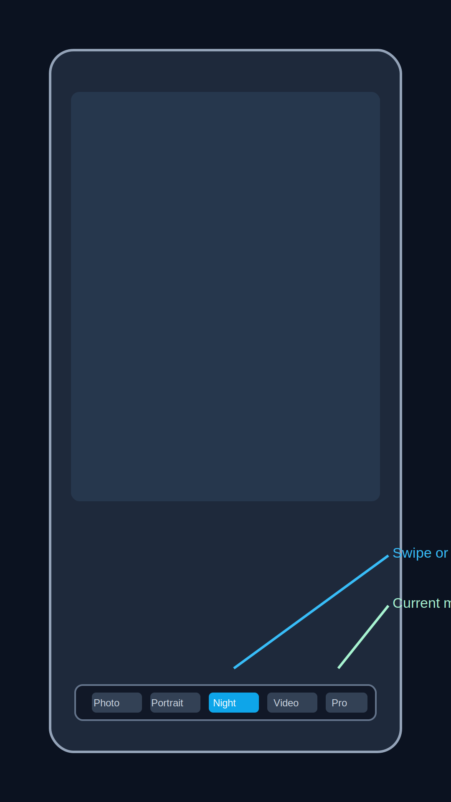
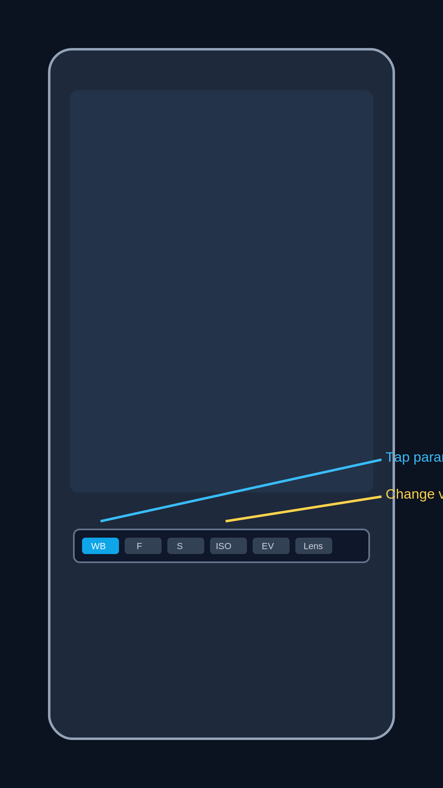

# Redmi Note 12 Pro+ Photo Manual

Короткий практический мануал по съемке на **Redmi Note 12 Pro+** в формате одной страницы.

## Быстрый вход

- [Куда нажимать в камере](#куда-нажимать-в-камере)
- [Быстрый старт (2 минуты)](#быстрый-старт-2-минуты)
- [Портрет](#портрет)
- [Ночная съемка](#ночная-съемка)
- [Видео](#видео)
- [Быстрая обработка (30-60 секунд)](#быстрая-обработка-30-60-секунд)
- [Особенности Redmi Note 12 Pro+](#особенности-redmi-note-12-pro)
- [Чеклисты](#чеклисты)

## Куда нажимать в камере

- `Tap subject`: тап по объекту для фокуса
- `Exposure slider`: после тапа сдвиньте яркость вверх/вниз
- `Modes`: переключение `Фото` / `Портрет` / `Ночь` / `Видео`
- `Shutter`: кнопка съемки
- `Gallery`: быстрая проверка кадра

## Быстрый старт (2 минуты)

### Перед съемкой

1. Протрите объективы
2. Проверьте заряд (лучше от 30%)
3. Освободите память (минимум 2-3 ГБ)

### Базовые настройки

1. Включите сетку (`grid`)
2. Оставьте HDR Auto для контрастных дневных сцен
3. Отключите лишние beauty-эффекты
4. Watermark включайте только при необходимости

### Универсальный алгоритм кадра

1. Выберите режим под задачу
2. Тапните по главному объекту
3. Подправьте экспозицию
4. Снимите 2-3 дубля
5. Сразу проверьте резкость и пересветы

## Режимы камеры

- `Фото`: универсальный режим, базовая точка `1x`
- `Портрет`: акцент на человеке и отделение фона
- `Ночь`: слабый свет, снимаем только с устойчивым хватом
- `Видео`: короткие дубли 5-20 сек
- `Pro`: ручные параметры `WB`, `F`, `S`, `ISO`, `EV`
- `200MP`: статичные сцены при хорошем свете и когда нужен кроп

## Свет и экспозиция

- Лучший свет для лица: мягкий боковой (окно, тень, пасмурно)
- При пересвете лица/вывесок: экспозиция в минус (`-0.3` ... `-1.0`)
- Ночью: сначала ищите источник света, потом строите кадр
- При сомнении снимайте дубль темнее и дубль светлее

## Портрет

### Быстрый алгоритм

1. Режим `Портрет`
2. Поставьте модель в мягкий свет
3. Тап по глазам
4. Экспозиция `-0.3` или `-0.7`, если есть пересвет
5. Снимите серию 5-10 кадров

### Рабочие сценарии

- Улица днем: `Портрет`, `1x`/`2x`, экспозиция `0` ... `-0.3`
- У окна: `Портрет` или `Фото` при сложных волосах
- Вечер/кафе: сначала `Фото`, потом дубль в `Портрет`, экспозиция в минус
- Полный рост: держите камеру на уровне груди, контролируйте вертикали

### Типичные ошибки

- Плоское лицо: разверните человека боком к свету
- Плохие края размытия: снимите дубль в `Фото`
- Шум вечером: меньше зума, ближе к источнику света

### Примеры

- [portrait-window-day-01.jpg](assets/examples/portrait/portrait-window-day-01.jpg)
- [portrait-window-day-02.jpg](assets/examples/portrait/portrait-window-day-02.jpg)
- [portrait-street-evening-01.jpg](assets/examples/portrait/portrait-street-evening-01.jpg)
- [portrait-cafe-evening-01.jpg](assets/examples/portrait/portrait-cafe-evening-01.jpg)

## Ночная съемка

### Базовый алгоритм

1. Включите `Ночь`
2. Используйте `1x`
3. Упритесь в опору или держите локти прижатыми
4. Нажмите кнопку и не двигайте телефон до завершения
5. Снимайте 2-3 дубля

### Сценарии

- Ночной город: `Ночь`, экспозиция `-0.3` ... `-1.0`
- Человек вечером: `Ночь` + дубль в `Фото`, модель просим замереть
- Кафе/интерьер: сравнивайте `Фото` и `Ночь`
- Очень темная сцена: сначала найдите свет (витрина, фонарь)

### Частые проблемы

- Смаз: больше опоры, повторный дубль
- Шум: добавить света, убрать цифровой зум
- Пересвет вывесок: затемнить экспозицию до съемки

### Примеры

- [night-city-signs-01.jpg](assets/examples/night/night-city-signs-01.jpg)
- [night-city-signs-02.jpg](assets/examples/night/night-city-signs-02.jpg)
- [night-neon-street-01.jpg](assets/examples/night/night-neon-street-01.jpg)
- [night-light-trails-01.jpg](assets/examples/night/night-light-trails-01.jpg)

## Видео

### Базовый пресет

- `1080p`, `30fps` для повседневных задач
- Дубли по 5-20 секунд

### Что важно

- Стабильный хват двумя руками
- Медленное движение (лучше короткими проходами)
- Свет спереди или сбоку от объекта
- Для речи подойдите ближе к источнику звука

### Минимальный набор дублей

1. Общий
2. Средний
3. Крупная деталь
4. Короткий финальный

## Быстрая обработка (30-60 секунд)

### Workflow

1. Открыть фото в Google Photos -> `Edit`
2. `Crop` + выровнять горизонт
3. `Highlights` слегка вниз, `Shadows` слегка вверх
4. По сцене добавить `Contrast`/`Warmth`
5. Сохранить через `Save copy`

### Быстрые диапазоны

- Портрет: `Highlights -15...-35`, `Shadows +10...+25`, `Warmth +5...+12`
- Ночь: `Highlights -20...-45`, `Shadows +5...+20`, `Contrast +5...+15`

### Ошибки

- Пересвет кожи: еще уменьшить `Highlights`
- "Грязные" цвета: ослабить `Warmth` и `Saturation`
- Потеря деталей: не завышать `Shadows` и `Sharpen`

## Особенности Redmi Note 12 Pro+

- Главная камера: `200MP`, `f/1.65`, OIS
- Ultra-wide: `8MP`, `120°`
- Macro: `2MP`
- Видео: до `4K 30fps`

Практика: основной рабочий модуль в большинстве сцен - главная камера `1x`.

### Когда включать 200MP

- Дневная статичная сцена
- Нужен запас под сильный кроп
- Есть время проверить резкость на увеличении

Не включайте `200MP` как режим по умолчанию ночью и в движении.

## Чеклисты

### Перед съемкой фото

- Объектив чистый
- Выбран правильный режим
- Фокус на главном объекте
- Экспозиция без критичного пересвета
- Есть 2-3 дубля

### Перед портретом

- Мягкий свет на лице
- Фокус по глазам
- Экспозиция при необходимости в минус
- Проверены края размытия
- Есть дубль в `Фото`

### Перед ночной съемкой

- Включен `Ночь`
- Есть упор/устойчивый хват
- Используется `1x`
- Снято несколько дублей
- Проверен смаз на увеличении

### Перед видео

- Горизонт ровный
- Движение контролируемое
- Сняты короткие дубли разной крупности
- Проверен звук (если важна речь)

### Перед сохранением обработанного кадра

- Горизонт выровнен
- Пересвет контролируется
- Сравнение с оригиналом сделано
- Сохранено через `Save copy`

## Файлы и процесс

- Примеры и шаблоны: [assets/examples/README.md](assets/examples/README.md)
- Процесс для агентов: [workflow/PROCESS.md](workflow/PROCESS.md)
- Правила для Codex: [AGENTS.md](AGENTS.md)
