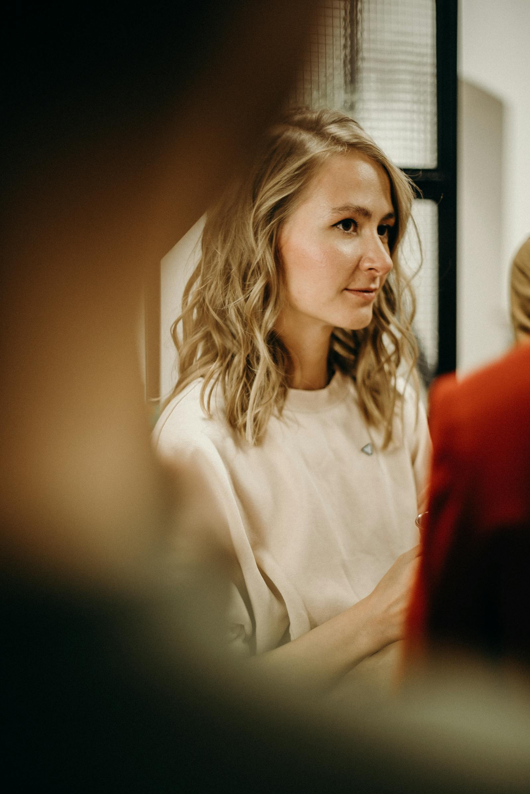
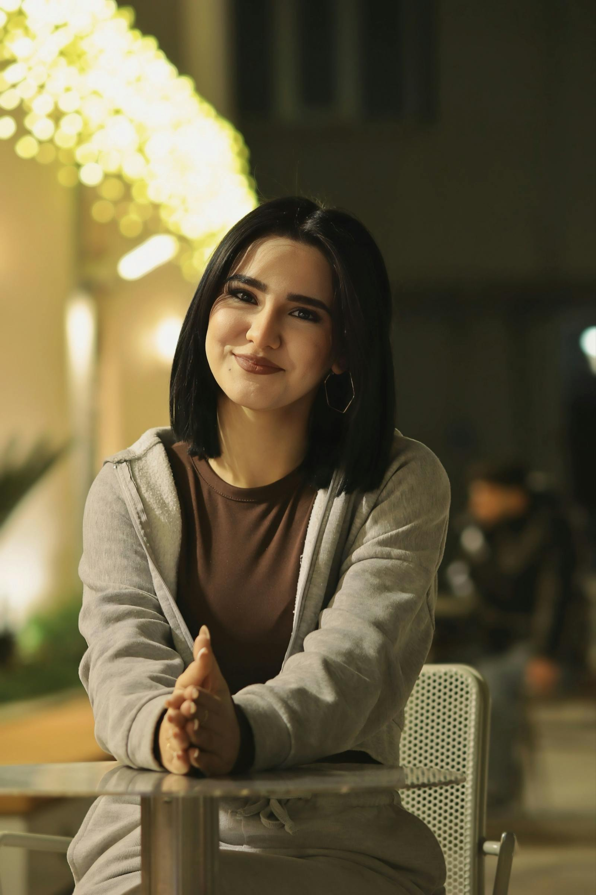
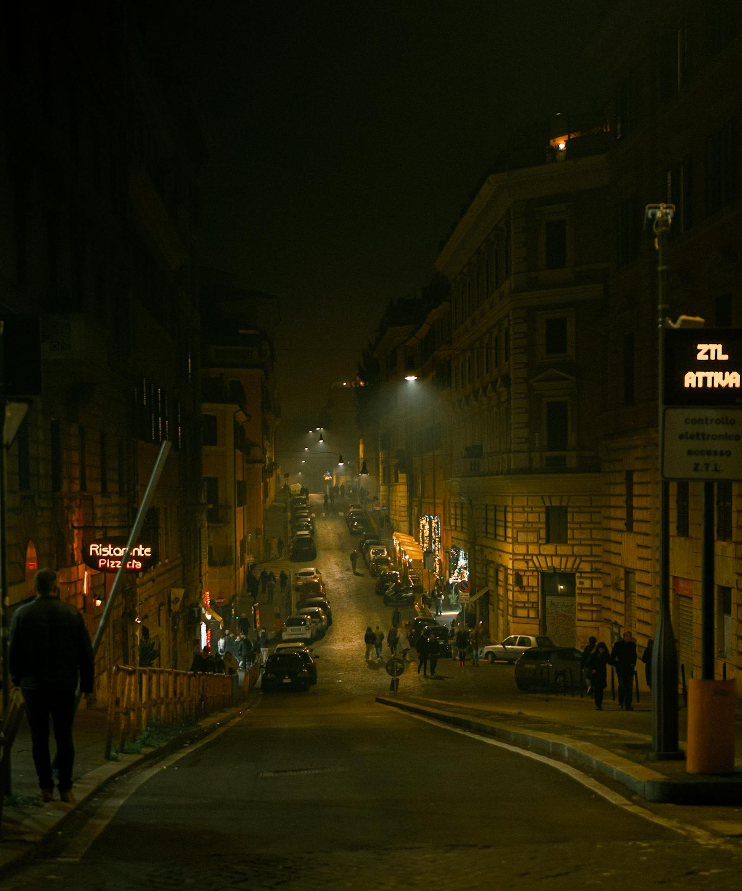
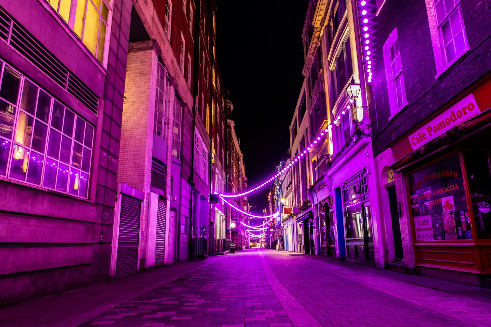

# Redmi Note 12 Pro+ Photo Manual

Короткий практический мануал по съемке на **Redmi Note 12 Pro+** в формате одной страницы.

## Если нет времени (20 секунд)

1. Выберите режим: `Фото` / `Портрет` / `Ночь` / `Видео`
2. Тапните по главному объекту
3. Подправьте экспозицию (часто лучше чуть в минус)
4. Снимите 2-3 дубля
5. Проверьте резкость и пересветы в галерее

## Быстрый вход

- [Куда нажимать в камере](#куда-нажимать-в-камере)
- [Таблица решений](#таблица-решений)
- [Быстрый старт (2 минуты)](#быстрый-старт-2-минуты)
- [Селфи](#селфи)
- [Портрет](#портрет)
- [Ночная съемка](#ночная-съемка)
- [Фото еды](#фото-еды)
- [Групповое фото](#групповое-фото)
- [Видео](#видео)
- [Сторис и Reels](#сторис-и-reels)
- [Как выбрать лучший кадр](#как-выбрать-лучший-кадр)
- [Быстрая обработка (30-60 секунд)](#быстрая-обработка-30-60-секунд)
- [Особенности Redmi Note 12 Pro+](#особенности-redmi-note-12-pro)
- [Чеклисты](#чеклисты)

## Куда нажимать в камере

- **Тап по объекту** — фокус + замер экспозиции
- **Ползунок яркости** — появляется после тапа, двигайте вверх/вниз
- **Режимы внизу** — свайп влево/вправо: `Фото` / `Портрет` / `Ночь` / `Видео`
- **Кнопка затвора** — большая круглая внизу по центру
- **Галерея** — миниатюра слева от затвора, проверка последнего кадра
- **Зум** — `0.6x` / `1x` / `2x` над режимами

## Таблица решений

| Сцена | Режим | Экспозиция | Сколько дублей | Что получится | Что чаще ломается |
|---|---|---|---|---|---|
| Селфи днем | `Фото` (фронталка) | `0` ... `-0.3` | 3-5 | Чистое лицо с естественным светом | Beauty-фильтры перестарались |
| Портрет днем | `Портрет` | `0` ... `-0.3` | 5-10 | Чистая кожа и отделение от фона | Ошибки по волосам и очкам |
| Портрет вечером/кафе | `Фото` + дубль `Портрет` | `-0.3` ... `-1.0` | 3-6 | Атмосферный свет без сильного пересвета | Шум и смаз при зуме |
| Ночной город | `Ночь` | `-0.3` ... `-1.0` | 2-4 | Контрастные огни и читаемая сцена | Смаз от движения рук |
| Фото еды | `Фото`, `1x`/`2x` | `0` ... `-0.3` | 3-5 | Аппетитные цвета и детали | Тени от рук и телефона |
| Групповое фото | `Фото`, `0.6x`/`1x` | `0` | 5-10 | Все в кадре и в фокусе | Кто-то моргнул или отвернулся |
| Видео на каждый день | `Видео` `1080p/30fps` | Auto | 3-5 коротких | Стабильный и легкий монтаж | Рывки из-за длинных проходов |
| Статичная деталь с запасом | `200MP` | `0` ... `-0.3` | 2-3 | Высокая детализация для кропа | Большой вес файла, риск шевеленки |

## Быстрый старт (2 минуты)

### Перед съемкой

1. Протрите объективы
2. Проверьте заряд (лучше от 30%)
3. Освободите память (минимум 2-3 ГБ)

### Базовые настройки

1. Включите сетку (`grid`)
2. Оставьте HDR Auto для контрастных дневных сцен
3. Отключите лишние beauty-эффекты
4. Watermark включайте только при необходимости

### Универсальный алгоритм кадра

1. Выберите режим под задачу
2. Тапните по главному объекту
3. Подправьте экспозицию
4. Снимите 2-3 дубля
5. Сразу проверьте резкость и пересветы

## Режимы камеры

- `Фото`: универсальный режим, базовая точка `1x`
- `Портрет`: акцент на человеке и отделение фона
- `Ночь`: слабый свет, снимаем только с устойчивым хватом
- `Видео`: короткие дубли 5-20 сек
- `Pro`: ручные параметры `WB` (баланс белого), `F` (ручной фокус), `S` (выдержка), `ISO` (чувствительность), `EV` (экспокоррекция)
- `200MP`: статичные сцены при хорошем свете и когда нужен кроп

## Свет и экспозиция

- Лучший свет для лица: мягкий боковой (окно, тень, пасмурно)
- При пересвете лица/вывесок: экспозиция в минус (`-0.3` ... `-1.0`)
- Ночью: сначала ищите источник света, потом строите кадр
- При сомнении снимайте дубль темнее и дубль светлее

## Селфи

### Быстрый алгоритм

1. Переключитесь на фронтальную камеру
2. Режим `Фото` (или `Портрет` для размытия фона)
3. Найдите мягкий свет — лицом к окну или светлой стене
4. Держите телефон чуть выше уровня глаз
5. Тапните по лицу для фокуса
6. Снимите 3-5 кадров с разным наклоном головы

### Сценарии

- На улице днем: встаньте в тень или спиной к солнцу, `Фото`, beauty минимум -> чистая кожа без пересвета
- В помещении у окна: лицом к окну под углом 30-45°, `Портрет` -> объемный свет и размытый фон
- Вечером/в кафе: ищите теплый свет сбоку, `Фото`, экспозиция `-0.3` -> атмосферный кадр без шума
- Зеркальное селфи: протрите зеркало, вспышка выключена, телефон на уровне груди

### Что портит селфи

- Beauty-фильтры на максимуме — лицо выглядит неестественно, уберите до минимума
- Прямое солнце в лицо — щуритесь, жесткие тени; повернитесь спиной к солнцу
- Телефон ниже подбородка — двойной подбородок и крупный нос; держите выше глаз
- Задний свет (окно за спиной) — лицо темное; развернитесь лицом к свету
- Грязная фронталка — мыльный кадр; протрите перед съемкой

## Портрет

### Быстрый алгоритм

1. Режим `Портрет`
2. Поставьте модель в мягкий свет
3. Тап по глазам
4. Экспозиция `-0.3` или `-0.7`, если есть пересвет
5. Снимите серию 5-10 кадров

### Рабочие сценарии

- Улица днем: `Портрет`, `1x`/`2x`, экспозиция `0` ... `-0.3` -> получится чистый портрет; ломается чаще всего по краям волос
- У окна: `Портрет` или `Фото` при сложных волосах -> получится объемный свет; ломается в контровом свете
- Вечер/кафе: сначала `Фото`, потом дубль в `Портрет`, экспозиция в минус -> получится атмосферный кадр; ломается по шуму
- Полный рост: камера на уровне груди, вертикали ровные -> получится естественная геометрия; ломается при низкой точке съемки

### Ракурс и позирование

- Камеру держите чуть выше уровня глаз
- Не снимайте слишком близко — искажаются пропорции
- Плечи лучше развернуть на 20-30 градусов, лицо вернуть к камере
- Руки модели лучше занять действием: волосы, очки, куртка

### Что проверить после кадра

- Резкость глаз
- Естественность размытия по краям
- Цвет кожи без пересвета
- Нет бликов на лбу/носу
- Фон не отвлекает яркими пятнами возле головы

### Типичные ошибки

- Плоское лицо: разверните человека боком к свету
- Плохие края размытия: снимите дубль в `Фото`
- Шум вечером: меньше зума, ближе к источнику света

### Примеры

- [portrait-window-day-01.jpg](assets/examples/portrait/portrait-window-day-01.jpg)
- [portrait-window-day-02.jpg](assets/examples/portrait/portrait-window-day-02.jpg)
- [portrait-street-evening-01.jpg](assets/examples/portrait/portrait-street-evening-01.jpg)
- [portrait-cafe-evening-01.jpg](assets/examples/portrait/portrait-cafe-evening-01.jpg)

## Ночная съемка

### Базовый алгоритм

1. Включите `Ночь`
2. Используйте `1x`
3. Упритесь в опору или держите локти прижатыми
4. Нажмите кнопку и не двигайте телефон до завершения
5. Снимайте 2-3 дубля

### Сценарии

- Ночной город: `Ночь`, экспозиция `-0.3` ... `-1.0` -> получится читаемый свет вывесок; ломается от шевеленки
- Человек вечером: `Ночь` + дубль в `Фото`, модель просим замереть -> получится живой портрет; ломается при движении
- Кафе/интерьер: сравнивайте `Фото` и `Ночь` -> получится более чистый вариант для конкретной сцены; ломается в пересвет ламп
- Очень темная сцена: сначала найдите свет (витрина, фонарь) -> получится меньше шума; ломается без источника света

### Частые проблемы

- Смаз: больше опоры, повторный дубль
- Шум: добавить света, убрать цифровой зум
- Пересвет вывесок: затемнить экспозицию до съемки

### Примеры

- [night-city-signs-01.jpg](assets/examples/night/night-city-signs-01.jpg)
- [night-city-signs-02.jpg](assets/examples/night/night-city-signs-02.jpg)
- [night-neon-street-01.jpg](assets/examples/night/night-neon-street-01.jpg)
- [night-light-trails-01.jpg](assets/examples/night/night-light-trails-01.jpg)

## Фото еды

### Быстрый алгоритм

1. Режим `Фото`, зум `1x` или `2x`
2. Снимайте сверху (flat lay) или под углом 45°
3. Тапните по главному блюду
4. Экспозиция `0` или чуть в минус, чтобы не терять цвет
5. Уберите лишнее со стола перед съемкой
6. Снимите 3-5 кадров

### Сценарии

- Кафе/ресторан: `Фото`, `1x`, свет от окна сбоку -> сочные цвета и текстуры; ломается от тени телефона
- Домашняя еда: поставьте тарелку ближе к окну, снимайте сверху -> чистый flat lay; ломается без естественного света
- Десерт/кофе крупно: `2x`, тап по главной детали -> красивое боке и акцент; ломается при тряске рук
- Street food на ходу: `Фото`, `1x`, быстро поймать момент -> живой кадр; ломается в тени/на ходу

### Что портит фото еды

- Вспышка — еда выглядит плоско и неаппетитно; используйте только естественный свет
- Тень от телефона/рук — сдвиньте тарелку или поменяйте угол
- Грязный фон (салфетки, мусор) — уберите лишнее из кадра
- Слишком далеко — еда теряется, подойдите ближе или используйте `2x`

## Групповое фото

### Быстрый алгоритм

1. Режим `Фото`, зум `0.6x` (ультраширик) или `1x`
2. Попросите всех встать ближе друг к другу
3. Тапните по центральному человеку
4. Включите таймер на 3 или 5 секунд, если снимаете с собой
5. Снимите минимум 5-10 кадров — кто-то точно моргнет

### Сценарии

- Компания на улице: `0.6x` если много людей, `1x` если 2-4 -> все помещаются; ломается по краям ультраширика (искажение лиц)
- За столом в кафе: `1x`, камера чуть выше уровня стола -> лица не перекрывают друг друга; ломается если кто-то далеко
- Праздник/день рождения: `Фото`, серия из 5-10 кадров -> хотя бы 1-2 кадра где все смотрят; ломается от моргания

### Что портит групповое фото

- Один человек далеко от группы — просите всех встать плотнее
- Солнце в лицо всей группе — развернитесь спиной к солнцу или встаньте в тень
- Ультраширик `0.6x` искажает крайних людей — поставьте их чуть ближе к центру
- Мало дублей — всегда снимайте 5+ кадров, потом выберете лучший

## Видео

### Базовый пресет

- `1080p`, `30fps` для повседневных задач
- Дубли по 5-20 секунд

### Что важно

- Стабильный хват двумя руками
- Медленное движение (лучше короткими проходами)
- Свет спереди или сбоку от объекта
- Для речи подойдите ближе к источнику звука

### Минимальный набор дублей

1. Общий
2. Средний
3. Крупная деталь
4. Короткий финальный

## Сторис и Reels

### Быстрый алгоритм

1. Снимайте вертикально (9:16)
2. Режим `Видео`, `1080p/30fps`
3. Дубли по 5-15 секунд — короче = лучше
4. Начинайте и заканчивайте с паузой в 1 секунду (для монтажа)
5. Снимите 3-5 разных планов одной сцены

### Что снимать

- Переход от общего к крупному (walk-in)
- Деталь крупно + отъезд назад (reveal)
- Медленная панорама вокруг объекта
- Лицо в камеру + пауза 2-3 секунды (для текста сверху)

### Что портит сторис

- Длинные дубли (больше 20 секунд) — теряется внимание, режьте на короткие
- Резкие движения камерой — двигайтесь медленно и плавно
- Плохой звук — подойдите ближе, или используйте текст вместо голоса
- Вертикальные + горизонтальные кадры вперемешку — выберите одну ориентацию

### Советы для монтажа

- Снимайте больше, чем нужно — лишнее удалите
- Каждый план снимайте отдельным дублем
- Для музыкального монтажа: короткие клипы по 2-3 секунды
- Для разговорного: средний план, стабильная камера, хороший свет на лице

## Как выбрать лучший кадр

### Алгоритм (30 секунд)

1. Откройте серию в галерее
2. Сразу удалите явный брак (смаз, закрытые глаза, палец в кадре)
3. Из оставшихся сравните 2-3 лучших на увеличении:
   - Резкость глаз/главного объекта
   - Нет пересвета на лице
   - Выражение лица естественное
4. Выберите один и обработайте его

### Что делает кадр лучше

- Глаза резкие и открытые
- Естественная улыбка (не напряженная)
- Свет подчеркивает лицо, а не убивает его
- Фон не отвлекает
- Горизонт ровный
- Нет лишних объектов по краям кадра

### Частая ошибка

Не выбирайте кадр по маленькой превью — всегда увеличивайте и проверяйте резкость. На маленьком экране кажется резким, а на самом деле смазано.

## Быстрая обработка (30-60 секунд)

### Workflow

1. Открыть фото в Google Photos -> `Edit`
2. `Crop` + выровнять горизонт
3. `Highlights` слегка вниз, `Shadows` слегка вверх
4. По сцене добавить `Contrast`/`Warmth`
5. Сохранить через `Save copy`

### Быстрые диапазоны

- Портрет: `Highlights -15...-35`, `Shadows +10...+25`, `Warmth +5...+12`
- Ночь: `Highlights -20...-45`, `Shadows +5...+20`, `Contrast +5...+15`
- Еда: `Warmth +5...+15`, `Saturation +5...+10`, `Shadows +5...+15`

### AI-инструменты (опционально)

- `Magic Eraser`: убрать мелкие отвлекающие объекты
- `Photo Unblur`: слегка поправить мягкий кадр
- `Magic Editor`: доступность зависит от устройства/аккаунта

### Ошибки

- Пересвет кожи: еще уменьшить `Highlights`
- "Грязные" цвета: ослабить `Warmth` и `Saturation`
- Потеря деталей: не завышать `Shadows` и `Sharpen`

## Особенности Redmi Note 12 Pro+

- Главная камера: `200MP`, `f/1.65`, OIS
- Ultra-wide: `8MP`, `120°`
- Macro: `2MP`
- Видео: до `4K 30fps`

Практика: основной рабочий модуль в большинстве сцен - главная камера `1x`.

### Когда включать 200MP

- Дневная статичная сцена
- Нужен запас под сильный кроп
- Есть время проверить резкость на увеличении

Не включайте `200MP` как режим по умолчанию ночью и в движении.

### OIS и ночная съемка

- OIS помогает снизить смаз, но не отменяет устойчивый хват
- После нажатия держите телефон неподвижно до конца экспонирования

### Полезные фичи камеры

- `Motion tracking focus`: фокус на движущемся объекте
- Быстрый запуск камеры с экрана блокировки (двойное нажатие)

## Актуальность

- Проверено: **2026-03-01**
- Интерфейс: HyperOS Camera (может немного отличаться по версии/региону)

## Чеклисты

### Перед съемкой фото

- Объектив чистый
- Выбран правильный режим
- Свет понятен (где главный источник)
- Фокус на главном объекте
- Экспозиция без критичного пересвета
- Есть 2-3 дубля

### Перед селфи

- Фронталка протерта
- Beauty на минимуме или выключен
- Свет на лице (не за спиной)
- Телефон чуть выше глаз
- Есть 3-5 кадров

### Перед портретом

- Мягкий свет на лице
- Фон не перегружен
- Фокус по глазам
- Экспозиция при необходимости в минус
- Проверены края размытия
- Есть варианты с разной дистанцией
- Есть дубль в `Фото`

### Перед ночной съемкой

- Включен `Ночь`
- Есть упор/устойчивый хват
- Используется `1x`
- Снято несколько дублей
- Проверен смаз на увеличении
- Главный объект повернут к источнику света

### Перед видео

- Горизонт ровный
- Движение контролируемое
- Сняты короткие дубли разной крупности
- Проверен звук (если важна речь)

### Перед сохранением обработанного кадра

- Горизонт выровнен (`Crop`)
- Пересвет снижен (`Highlights`)
- Тени подняты умеренно (`Shadows`)
- Сравнение с оригиналом сделано
- Сохранено через `Save copy`

## Для редакторов мануала

- Примеры и шаблоны: [assets/examples/README.md](assets/examples/README.md)
- Правила для Codex: [AGENTS.md](AGENTS.md)
