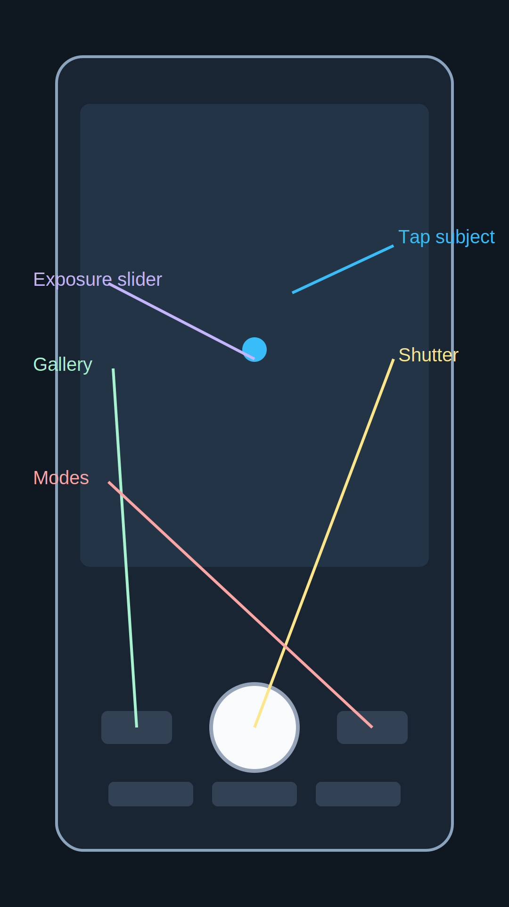

# 01. Быстрый старт (2 минуты)

## Перед съемкой

1. Протрите объективы мягкой тканью
2. Проверьте заряд (желательно от 30%)
3. Освободите память (минимум 2-3 ГБ)

## Базовые настройки камеры

1. Включите сетку (grid) для выравнивания композиции
2. Включите HDR Auto для контрастных сцен днем
3. Включите watermark только если он действительно нужен
4. Отключите лишние beauty-эффекты для естественного кадра

## Куда нажимать в интерфейсе

- `Tap subject`: тап по главному объекту для фокуса
- `Exposure slider`: после тапа двигаем яркость вверх/вниз
- `Modes`: переключение Фото/Портрет/Ночь/Видео
- `Shutter`: кнопка съемки
- `Gallery`: быстрая проверка результата

## Универсальный алгоритм кадра

1. Выберите режим (Фото/Портрет/Ночь/Видео)
2. Тапните по главному объекту для фокуса
3. Подправьте яркость ползунком экспозиции
4. Сделайте 2-3 кадра с небольшими вариациями

## Быстрая проверка качества

- Резкость на главном объекте
- Нет пересвеченного неба/лица
- Горизонт ровный
- Кадр не завален и не обрезает важные детали
