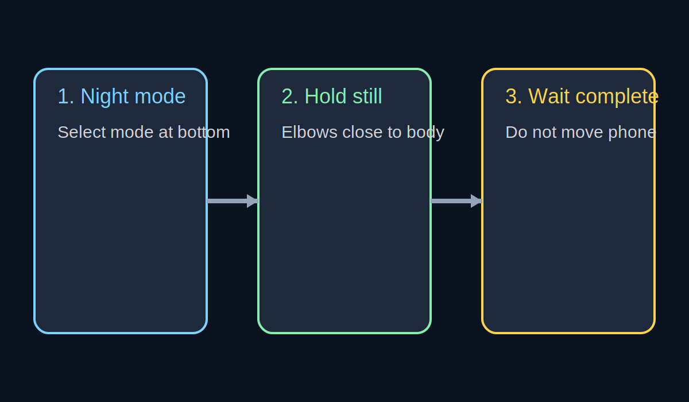

# 05. Ночная съемка

## Базовый принцип ночи

Главное в ночной съемке на смартфон: стабильность + свет.  
Если кадр смазан, никакая обработка это не исправит.

## Подготовка (10 секунд)

1. Включите режим `Ночь`
2. Примите устойчивую стойку или упритесь в опору
3. Используйте `1x` как основной вариант
4. Заранее выберите точку фокуса на главном объекте

## Во время съемки (критично)

- Нажмите кнопку и держите смартфон неподвижно до завершения кадра
- Для людей просите замереть на 1-2 секунды
- Снимайте по 2-3 дубля на каждую сцену
- Держите локти прижатыми к корпусу
- Не используйте много цифрового зума

## Сценарии и пресеты

### 1) Ночной город с вывесками и фонарями

- Режим: `Ночь`
- Зум: `1x`
- Экспозиция: `-0.3` до `-1.0` (чтобы не выбить вывески)
- Прием: снимите дубль темнее и дубль светлее

### 2) Человек на улице вечером

- Режим: `Ночь`, дополнительно дубль в `Фото`
- Дистанция: близко к человеку, но без искажений
- Свет: поставьте лицо к фонарю/витрине под углом
- Просьба модели: замереть на момент съемки

### 3) Кафе/интерьер с теплым светом

- Режим: `Фото` и `Ночь` (для сравнения)
- Экспозиция: немного в минус, чтобы сохранить атмосферу ламп
- Фокус: на лице/главном объекте, не на яркой лампе

### 4) Темная сцена без достаточного света

- Если света мало, сначала найдите его (витрина, фонарь, окно)
- Без света кадр будет шумным даже в ночном режиме
- Лучше сменить точку съемки, чем вытягивать "мертвый" кадр

## Что помогает получить чище кадр

- Больше реального света в сцене (витрины, фонари, вывески)
- Меньше цифрового зума
- Коррекция экспозиции в минус при ярких источниках
- Серийная съемка: 2-3 дубля на один кадр
- Контроль горизонта и геометрии перед нажатием

## Частые проблемы и решения

- Смаз: упор локтей, опора, повторный дубль
- Шум: добавить света или перейти в лучше освещенную точку
- Пересвет вывесок: немного затемнить экспозицию до съемки
- Лицо темное на фоне ярких огней: повернуть человека к источнику света
- Картинка "грязная" по цвету: снять дополнительный дубль в `Фото` для сравнения

## Реальные примеры

- [night-city-signs-01.jpg](../assets/examples/night/night-city-signs-01.jpg) - городской кадр с вывесками, экспозиция снижена для контроля ярких зон
- [night-city-signs-02.jpg](../assets/examples/night/night-city-signs-02.jpg) - дубль той же сцены с другой экспозицией для выбора лучшего баланса
- [night-neon-street-01.jpg](../assets/examples/night/night-neon-street-01.jpg) - неоновый свет, акцент на сохранении цвета и контраста
- [night-light-trails-01.jpg](../assets/examples/night/night-light-trails-01.jpg) - сюжет с движением света, важна стабильная фиксация смартфона

