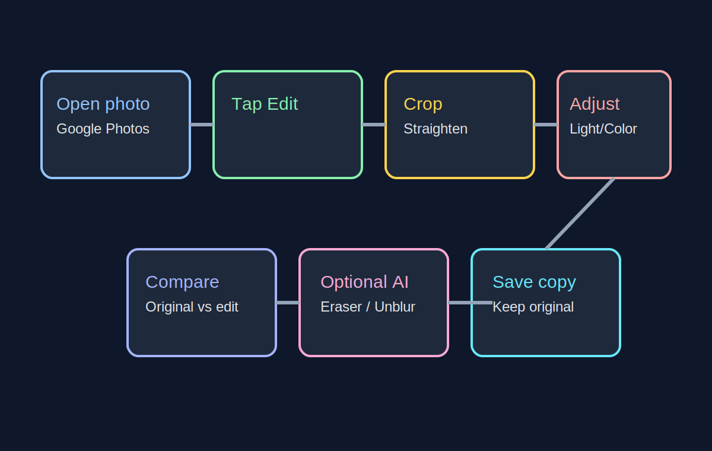

# 07. Быстрая Постобработка (30-60 секунд)

Цель: быстро улучшить кадр на телефоне без долгого редактирования.

## Базовый workflow

1. Откройте фото в Google Photos и нажмите `Edit`
2. Сначала сделайте `Crop` и выровняйте горизонт
3. В `Adjust` слегка уменьшите `Highlights` и поднимите `Shadows`
4. Чуть добавьте `Contrast` и `Warmth` по сцене
5. Сохраните через `Save copy`, чтобы оставить оригинал

## Быстрые пресеты

### Портрет

- `Highlights`: `-15` ... `-35`
- `Shadows`: `+10` ... `+25`
- `Warmth`: `+5` ... `+12`

### Ночная сцена

- `Highlights`: `-20` ... `-45`
- `Shadows`: `+5` ... `+20`
- `Contrast`: `+5` ... `+15`

## AI-инструменты (опционально)

- `Magic Eraser`: убрать мелкие отвлекающие объекты
- `Photo Unblur`: слегка поправить мягкий кадр
- `Magic Editor`: доступность зависит от устройства/аккаунта

Если есть риск перебора, уменьшайте правки и сверяйтесь с оригиналом.

## Частые ошибки

- Слишком яркие лица после редактирования: уменьшить `Highlights`
- "Грязные" цвета ночью: ослабить `Warmth` и `Saturation`
- Потеря деталей: не завышать `Shadows` и `Sharpen`

## Источники

- Google Photos Help: https://support.google.com/photos/answer/6128850
- Google Photos features: https://www.google.com/photos/features/
